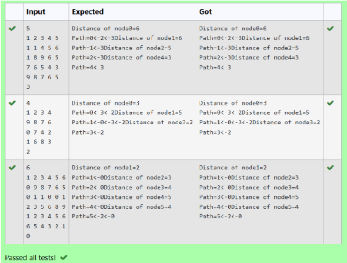

# Ex28 Dijkstra’s Algorithm
## DATE: 23/04/2025
## AIM:
To write a C Program to implement Dijkstra's Algorithm to find the shortest path

## Algorithm
1. Start
2. Read the number of vertices n and the adjacency matrix G representing the graph.
3. Read the starting node u for Dijkstra's algorithm.
4. Create the cost matrix where each G[i][j] is copied, and replace 0 values with infinity (except for the diagonal).
5. Initialize the distance, pred, and visited arrays.
6. For each node, find the one with the minimum distance that hasn't been visited. Update the distances and predecessors of its unvisited neighbors.
7. Repeat the process until all nodes are visited.
8. After the algorithm completes, print the shortest distance from the start node to each node and the path taken to reach each node.
9. End 

## Program:
```
/*
Program to implement Dijkstra's Algorithm 
Developed by: JAYASREE R
RegisterNumber:  212223230087
*/

#include<stdio.h> 
#defineINFINITY9999
#define MAX10
voiddijkstra(int G[MAX][MAX],int n,intstartnode); 
int main()
{
int G[MAX][MAX],i,j,n,u; 
scanf("%d",&n); 
for(i=0;i<n;i++) 
for(j=0;j<n;j++) 
scanf("%d",&G[i][j]); 
scanf("%d",&u);
dijkstra(G,n,u); 
return 0;
}
void dijkstra(int G[MAX][MAX],int n,intstartnode)
{
int cost[MAX][MAX],distance[MAX],pred[MAX]; 
int visited[MAX],count,mindistance,nextnode,i,j;
//pred[]storesthe predecessor ofeach node
//count givesthe number ofnodesseenso far
//createthecost matrix 
for(i=0;i<n;i++) 
for(j=0;j<n;j++) 
if(G[i][j]==0) 
cost[i][j]=INFINITY; 
else
cost[i][j]=G[i][j];
//initializepred[],distance[] andvisited[] 
for(i=0;i<n;i++)
{
distance[i]=cost[startnode][i]; 
pred[i]=startnode; 
visited[i]=0;
}
distance[startnode]=0; 
visited[startnode]=1; 
count=1; 
while(count<n-1)
{
mindistance=INFINITY;
//nextnode givesthe nodeat minimumdistance 
for(i=0;i<n;i++) 
if(distance[i]<mindistance&&!visited[i])
{
mindistance=distance[i]; 
nextnode=i;
}
//check ifa better pathexiststhroughnextnode 
visited[nextnode]=1;
for(i=0;i<n;i++) 
if(!visited[i])
if(mindistance+cost[nextnode][i]<distance[i])
{
distance[i]=mindistance+cost[nextnode][i]; 
pred[i]=nextnode;
}
count++;
}
//print the pathand distanceofeachnode
for(i=0;i<n;i++) 
if(i!=startnode)
{
printf("Distanceofnode%d=%d\n",i,distance[i]); 
printf("Path=%d",i);
j=i; 
do{
j=pred[j]; 
printf("<-%d",j);
}while(j!=startnode);
}
}

```

## Output:



## Result:
Thus, the Program to implement Dijkstra's Algorithm to find the shortest path is implemented successfully.
